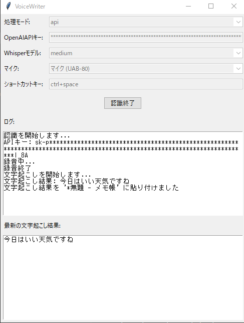

.ven# VoiceWriter

VoiceWriterは、音声をリアルタイムでテキストに変換し、自動的にクリップボードにコピーして指定したアプリケーションに貼り付けるPythonアプリケーションです。



## 特徴

- リアルタイム音声認識
- OpenAI WhisperモデルまたはOpenAI APIを使用した高精度な文字起こし
- カスタマイズ可能なショートカットキー
- 複数の処理モード（API、CPU、CUDA）をサポート
- 使いやすいGUIインターフェース

## 必要条件

- Python 3.7以上？
- PyAudio
- OpenAI Whisperinstall r requi  
- PyTorch
- その他の依存ライブラリ（requirements.txtを参照）

## インストール

1. リポジトリをクローンまたはダウンロードします。
2. 必要なライブラリをインストールします：
   ```
   pip install -r requirements.txt
   ```

## 使用方法

1. `voicewriter.py`を実行します：
   ```
   python voicewriter.py
   ```
2. GUIで設定を行います：
   - 処理モードを選択（API、CPU、CUDA）
   - APIキーを入力（APIモードの場合）
   - Whisperモデルを選択（CPUまたはCUDAモードの場合）
   - マイクを選択
   - ショートカットキーを設定
3. 「認識開始」ボタンをクリックします。
4. 設定したショートカットキーを押しながら話すと、音声が認識されテキストに変換されます。
5. 変換されたテキストは自動的にクリップボードにコピーされ、アクティブなウィンドウに貼り付けられます。

## 設定

設定はJSONファイル（`voicewriter_config.json`）に保存され、アプリケーション終了時に自動的に更新されます。

## 注意事項

- CUDAモードを使用する場合は、NVIDIA GPUとCUDAツールキットが必要です。
- APIモードを使用する場合は、有効なOpenAI APIキーが必要です。
